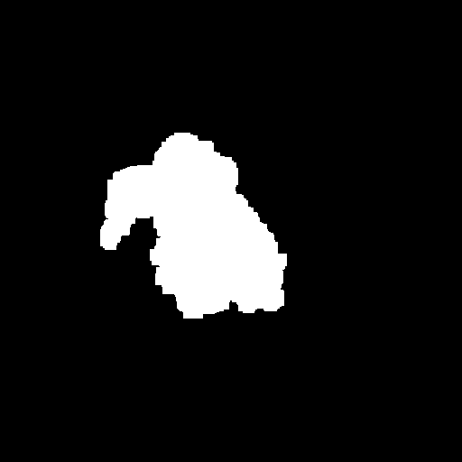

# Dust-Segmentation
Labeling and Segmentation of Dust

##  Deep learning based semantic segmentation of dust
VGG-Unet Model 
`model.py`
[Trained Models](https://choosealicense.com/licenses/mit/)

Dust Segmentation Dataset: [Trained Models](https://choosealicense.com/licenses/mit/)
Folder Structure
    .
    ├── ...
    ├── test                    # Test files (alternatively `spec` or `tests`)
    │   ├── benchmarks          # Load and stress tests
    │   ├── integration         # End-to-end, integration tests (alternatively `e2e`)
    │   └── unit                # Unit tests
    └── ...

##  GUI Dust Labeling
Hier noch text

Input image            |  Output mask
:-------------------------:|:-------------------------:
  |  

## License
 This work is licensed under a <a rel="license" href="http://creativecommons.org/licenses/by-nc-sa/4.0/">Creative Commons Attribution-NonCommercial-ShareAlike 4.0 International License</a>.

## Citation
