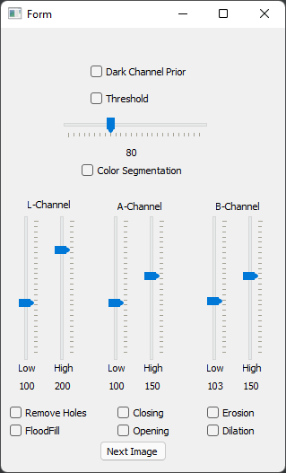
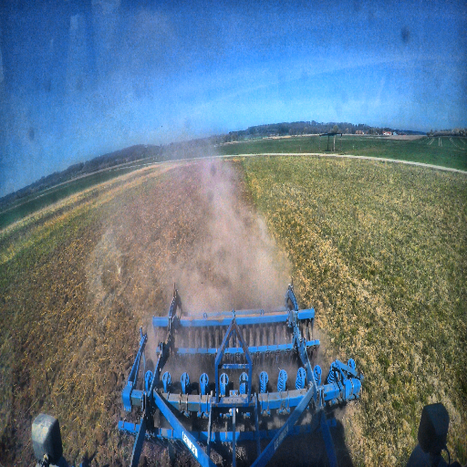

# Dust-Segmentation
Semantic segmentation of urban areas for simulation purposes

This is the official implementation of the corresponding Paper (see Citation) and provides NN model and an overview.

##  GUI Dust Labeling

.png)

## License
 This work is licensed under a <a rel="license" href="http://creativecommons.org/licenses/by-nc-sa/4.0/">Creative Commons Attribution-NonCommercial-ShareAlike 4.0 International License</a>.

## Citation
